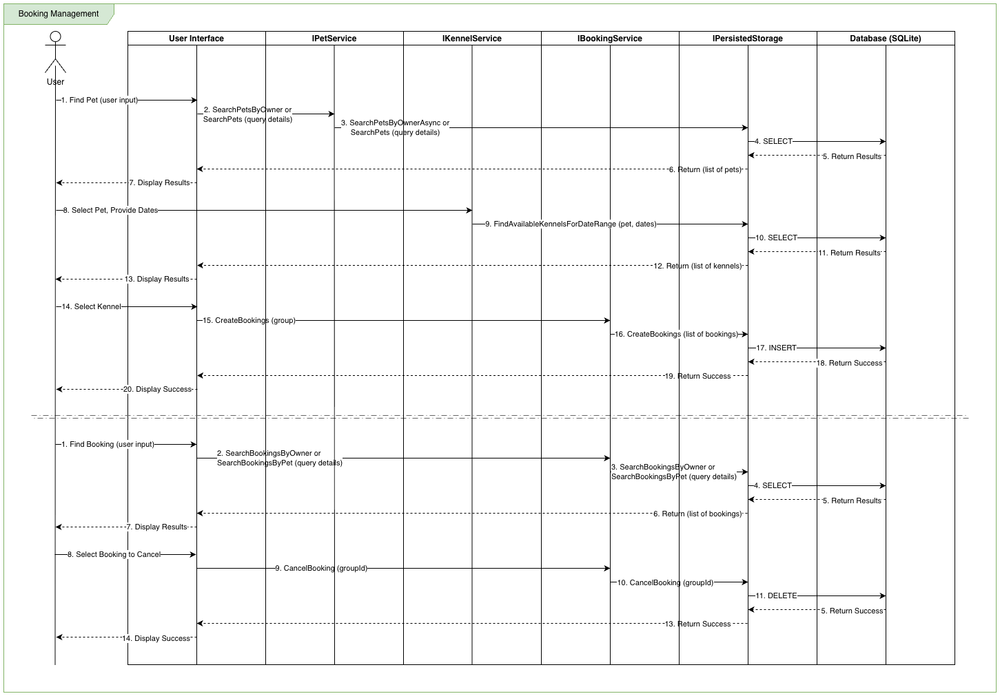
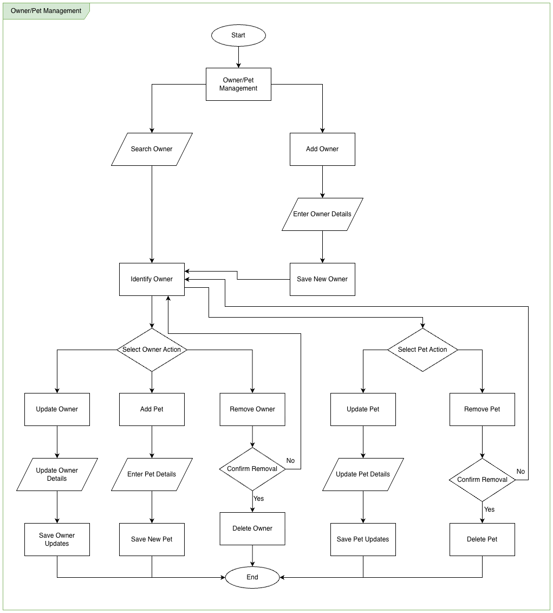
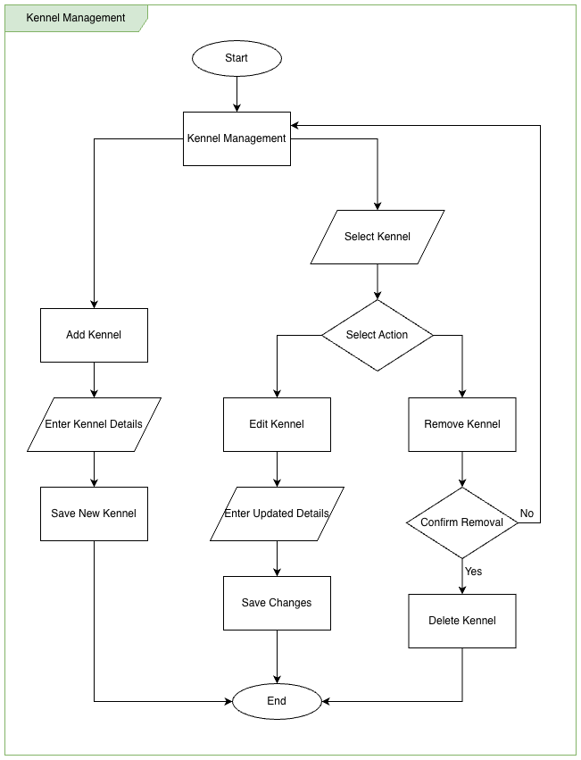
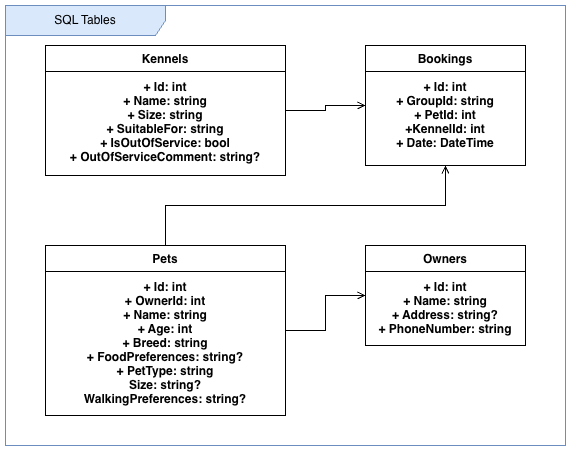
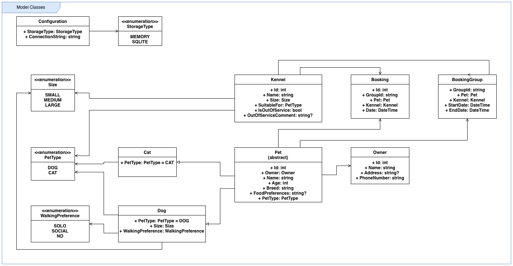
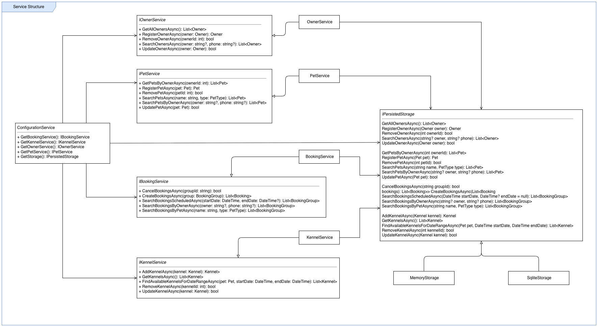

# About 🐾 Kennel Management System (KMS)

The Kennel Management System (KMS) is a console-based application designed to streamline the operations of a pet boarding facility. It provides functionalities for managing pets, owners, kennels, and bookings. The application is built using C# and features a user-friendly terminal interface.


## ✨ Features

* **Booking System:** This provides the functionality for handling pet bookings. It provides the ability to create new bookings for pets in available kennels and to cancel existing future bookings.



* **Owner Management:** This module handles the registration and management of pet owners and their pets. It allows for creating new owner and pet profiles, as well as updating or removing existing ones.



* **Kennel Management:** This provides functionalities for managing the kennels available for booking. Users can add new kennels, update the details of existing ones (for example making the kennel as out-of-service), or removing them from the system.




* **Persistent Storage:** Supports multiple storage backends, currently this includes in-memory and SQLite database (the database table structure used by SQLite is illustrated below). Other persisted storage targets would simply just need to implentent `IPersistedStorage`.




## ⚙️ Configuration

The application can be configured via the `config.json` file. This needs to exist in the directory where the application is launched. The defaults for this file are in `src/Resources` and are included in the package.

**Example `config.json`: -**
```json
{
    "StorageType": "SQLITE",
    "ConnectionString": "Data Source=kms.sqlite.db"
}
```

Key configuration options include: -

* **`StorageType`**: Determines the storage backend. The supported values are: -

    *   `"MEMORY"`: For an in-memory data store (data is lost when the application closes).
    *   `"SQLITE"`: For a persistent SQLite database.

* **`ConnectionString`**: When using SQLite, this specifies the connection string, including the path to the database file (e.g., `"Data Source=kms.sqlite.db"`).


## 📂 Project Structure

The project is organized into the following directories:

```
.
├── src/
│   ├── Models/         # Contains the core domain models (Pet, Owner, Kennel, etc.).
│   ├── Services/       # Business logic and service interfaces.
│   ├── Storage/        # Handles data persistence (currently supports Memory and SQLite).
│   ├── View/           # Contains the UI components and screens.
│   ├── Util/           # Utility classes and helper functions.
│   ├── Resources/      # Embedded resources like SQL scripts and configuration.
│   └── Program.cs      # Main application entry point.
├── test/               # Unit and integration tests.
└── documentation/      # Project documentation, diagrams, and notes.
```


## 📝 Code Structure

The application is designed with a clear separation of concerns, utilizing a layered architecture consisting of models, services, and views.

Additionally, a stroage interface is provided and allows perstance in a SQLite database. This also allows for easy implementation of other persistance targets as required.

### Model Class Structure

The core data entities of the application are defined in the  directory. These classes represent the fundamental objects that the system works with.



### Service Structure

The business logic is encapsulated within services found in the  directory. These services provide an interface for interacting with the application's data and functionality. The design follows an interface-based approach to allow for dependency injection and easier testing.




---
*Copyright © 2025*
